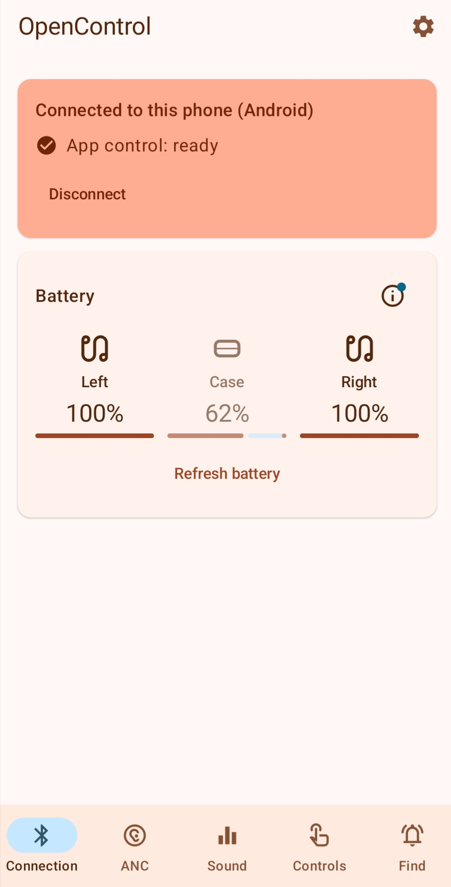
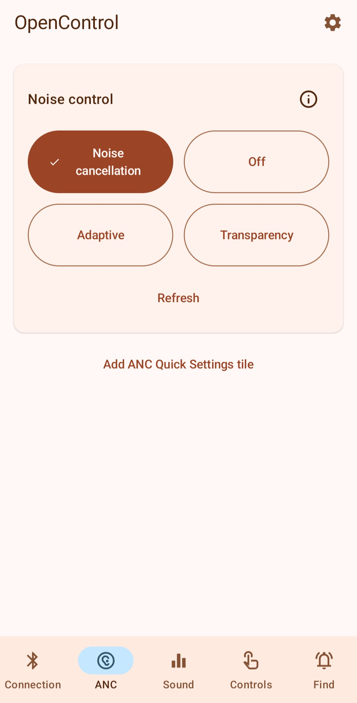
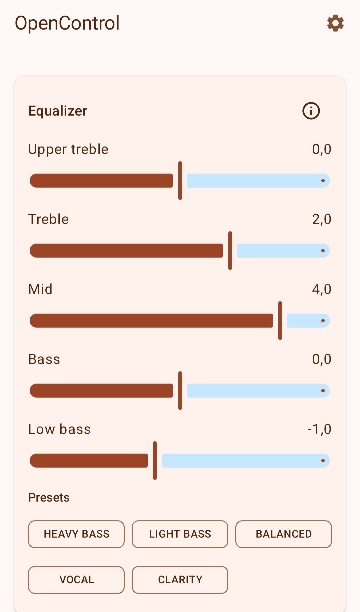
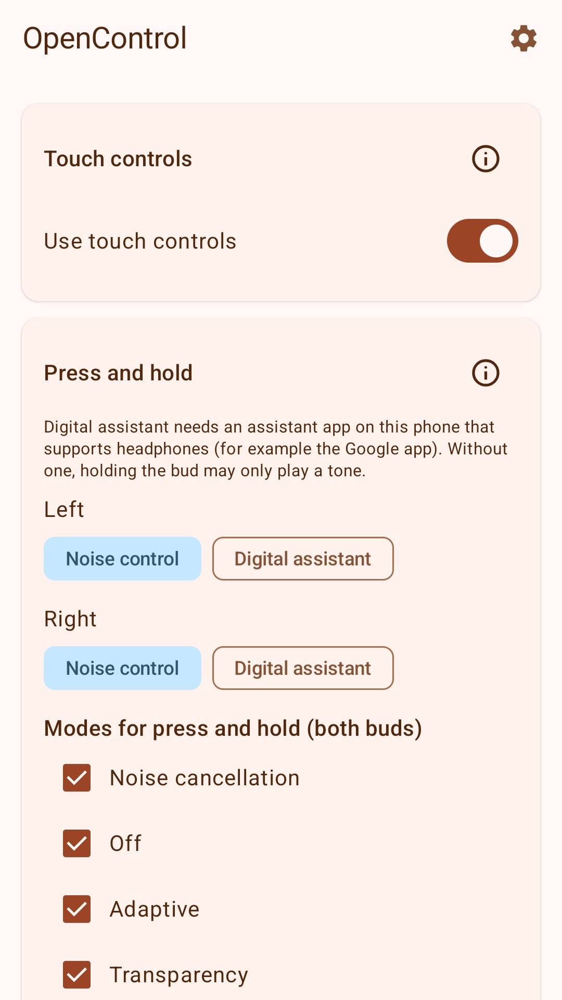
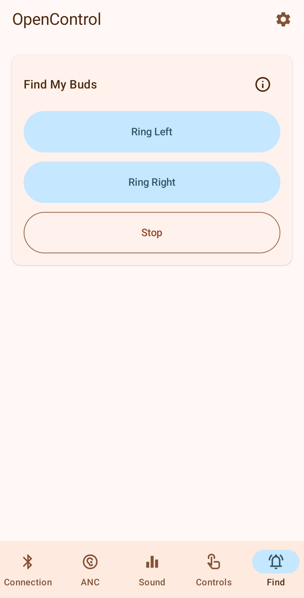
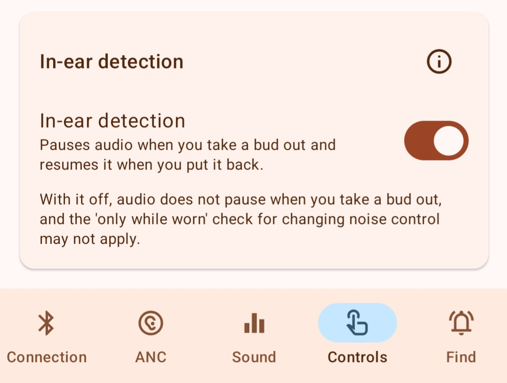
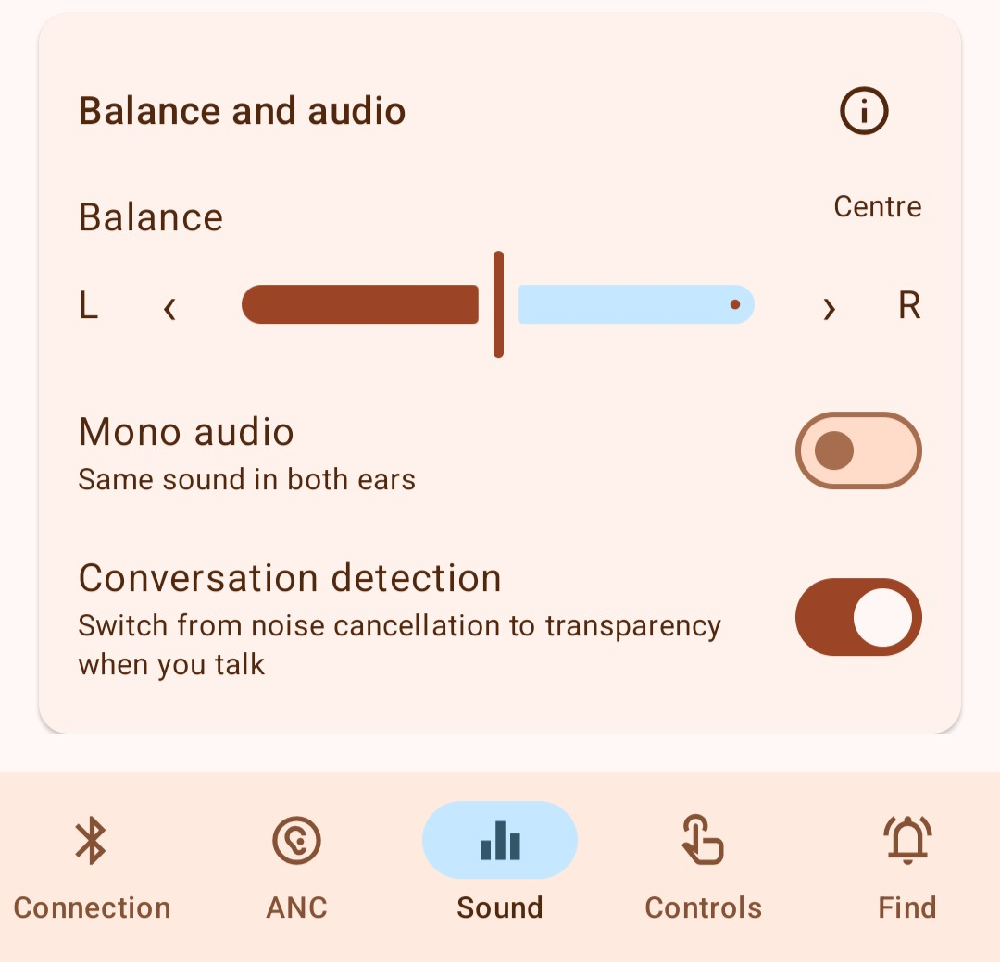
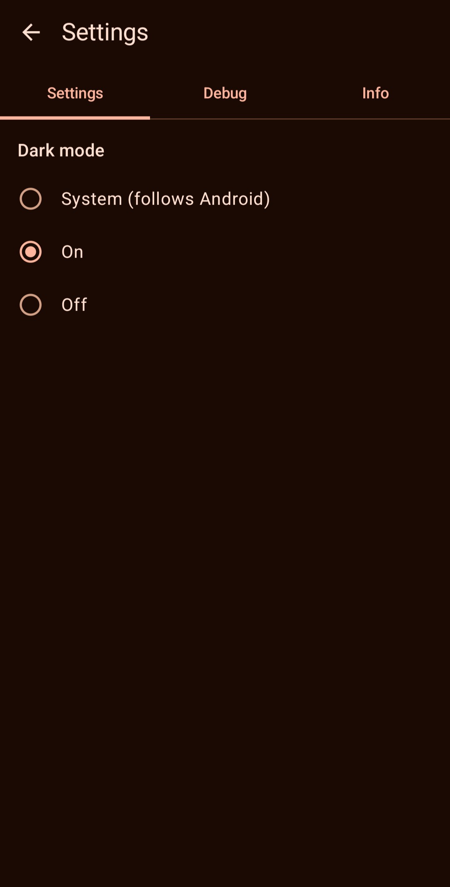
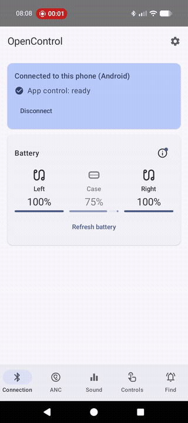

# OpenControl for Pixel Buds Pro 2

An independent, open-source Android app to control your **Google Pixel Buds Pro 2** without the official Pixel Buds app and without Google Play services.
It works fully offline: no `INTERNET` permission, no location permission, no account, no analytics. Made and tested on GrapheneOS.

*Works with Google Pixel Buds Pro 2. Not affiliated with or endorsed by Google. Pixel Buds is a trademark of Google LLC.*

## Download & install

> **Latest release: [1.0.0](https://github.com/tedsluis/opencontrolpixelbudspro2/releases/tag/v1.0.0)** (2026-10-03). You can also
> [build the app from source](#building-from-source).

- Get the APK from the [Releases page](https://github.com/tedsluis/opencontrolpixelbudspro2/releases) — the only place it is published.
- **Android 14 (API 34) or newer.**
- Open the downloaded file; Android asks you to allow **"Install unknown apps"** for the app you opened it with (your browser or file manager) — allow it
  for that one install if you like, and switch it off again afterwards.
- **Check the download (optional):** every release lists the APK's SHA-256 and the SHA-256 of its signing certificate. Compare with `sha256sum <file>.apk`
  and `apksigner verify --print-certs <file>.apk`. The certificate stays the same for every release.
- **Updates are manual:** the app never checks for updates. Watch the repository's releases on GitHub, or let an app such as Obtainium follow the
  Releases page for you. A newer APK installs over the old one and keeps your settings (same signing key).

## What it does

- **Noise control:** Noise cancellation, Adaptive, Transparency, Off — plus a Quick Settings tile.
- **Equalizer:** five bands and the presets.
- **Battery:** Left and Right (with "charging in the case") and the Case.
- **Find My Buds:** ring the Left or Right bud.
- **Controls:** touch controls on/off, press and hold per bud (noise control or digital assistant) and which noise-control modes it cycles through.
- **Sound:** balance, mono audio, conversation detection; **in-ear detection** on/off.
- **Settings:** dark mode (System / On / Off), a Debug screen, and an Info tab with the app's build, the Buds' firmware and the licence.

## What it does not do

- Ring the Case, or both buds at once (in the official app this goes through Google's Find My Device network — `DECISIONS.md` ADR-027).
- Firmware updates.
- Manage multipoint connections; head gestures; case sounds.
- Anything that needs a Google account.
- Audio itself — playback and codecs stay with Android.

## Screenshots

<p>
  
  
  
  
</p>
<p>
  
  
  
  
</p>

**Screen recording** (60 s; the preview shows the first 12 s — click it for the full MP4):

[](images/opencontrol-for-buds-demo.mp4)

*The screenshots and the recording were made on 2026-10-01 with a development build. Since then the balance slider has lost its `‹`/`›` step buttons
(`ai-sessions/0066`); everything else looks the same.* For comparison: the official app's screens are in
[`SCREENSHOTS_PIXEL_BUDS_APP.md`](./SCREENSHOTS_PIXEL_BUDS_APP.md).

## Privacy

- No `INTERNET` permission — CI checks every build for it (`.github/workflows/android.yml`). No analytics, no crash reporting, no account.
- No location permission and no Bluetooth scanning: the app talks only to the Buds you paired, through Android's companion-device pairing.
- Its settings stay on the phone and are excluded from backups and device transfer.
- The two links on the Info tab (README, issues) open only when you tap them, in your browser.
- Permissions: `BLUETOOTH_CONNECT` (talk to the Buds), `POST_NOTIFICATIONS` and the foreground-service permissions (the "connected" notification).

## Safety and Safe Mode

This app sends commands that were reverse-engineered, not documented by Google. That carries a real, if small, **risk of putting your earbuds or case into
a bad state** — use it at your own risk, on hardware you are prepared to lose.

The app protects you where it can: it changes settings only when the Buds announce the firmware it was verified with (`release_5.203`) and, on the Fast Pair
channel, the Pixel Buds Pro 2's model ID. Otherwise it opens in read-only **Safe Mode** and sends no setting changes (`ARCHITECTURE.md` §8.1, `DECISIONS.md`
ADR-042). On hardware, Safe Mode refused every write when the firmware could not be confirmed (`CAP-061`) and allowed them on the verified firmware
(`CAP-062`, `CAP-063`); other firmware versions have not been tested. If something goes wrong, see the factory-reset procedure in
[`WORKSTATION_PREPARATIONS.md`](./WORKSTATION_PREPARATIONS.md) (Disaster Recovery).

## Status

**1.0.0 is released** (2026-10-03, see above): the release APK passed its hardware run `CAP-067` in a GrapheneOS user
without Google Play services (`PROJECT.md` Definition of done ticked). Tested on one phone — a Pixel 9a with GrapheneOS (Android 17) — with Buds firmware `release_5.203`.
Per feature, what is hardware-verified and what is only unit-tested is in `ARCHITECTURE.md` §5a; the history of every change is in
[`CHANGELOG.md`](./CHANGELOG.md). Found a bug? [Open an issue](https://github.com/tedsluis/opencontrolpixelbudspro2/issues/new/choose) — a suspected
security problem goes through [`SECURITY.md`](./SECURITY.md) instead.

---

*The rest of this page is for contributors: how the protocol was reconstructed and how the app is built.*

## Why

The official Pixel Buds app requires Google Play Services. This project
reconstructs the BLE/RFCOMM communication protocol between the official app and
the Buds based on the maintainer's own, legally obtained Bluetooth captures and
APK analysis of software the maintainer has installed themselves — with the goal
of a free, privacy-friendly implementation that also works on GrapheneOS and other
Google-free Android variants.

## Project goal

Build an open, self-contained Android app that lets you fully manage the Pixel
Buds Pro 2 (ANC modes, EQ, touch controls, battery, case sounds, etc.) with no
dependency on the official Pixel Buds app or Google Play Services (GMS).

To get there, the communication protocol between the official Pixel Buds app and
the Pixel Buds Pro 2 first has to be reconstructed through Bluetooth traffic
analysis and reverse engineering of the Android APK. That knowledge is then used
to design, implement, test, and document a native Android app.

## Current state (2026-10-03)

- **Captures:** 67 registered sessions (`CAP-001`–`CAP-067`): 60 analyzed, 5 planned,
  2 withdrawn (`CAP-052`, `CAP-057`) — see `CAPTURE_BLUETOOTH_HCI_SNOOP.md` §9 and `id_registry.csv`. `CAP-059`–`CAP-067`
  are captures of this project's own app (`CAP-067`: the 1.0.0 release APK without Google Play services); the Safe-Mode fix of `ai-sessions/0046` was hardware-verified in `CAP-062`/`CAP-063`.
- **APK analysis:** one companion-app version fully pulled, decompiled, and analyzed (`v1.0.955078536-10253511`) — see
  `reverse-engineering/APK_VERSIONS.md`. DLCI 0x04/0x08's transport code is not in it (ADR-025): both channels are implemented
  independently, from wire-capture evidence (and, for DLCI 0x04, the public Fast Pair spec).
- **Decisions:** 51 ADRs (`DECISIONS.md`); every 🟢 FACT in `PROTOCOL.md` has an explicit maintainer sign-off.
- **Implemented in the app:** ANC/Transparency/Adaptive (DLCI 0x04, ADR-009), Find My Buds Left/Right (ADR-011), EQ read and write
  (DLCI 0x02 pw_rpc, ADR-020/034), battery Left/Right with charging (ADR-033) and the Case (DLCI 0x02 `SubscribeRuntimeInfo`, ADR-043),
  the settings reads (ADR-036) and writes (touch controls, press and hold, conversation detection, balance, mono, in-ear detection — ADR-045/046/047),
  firmware line, ANC Quick Settings tile, Safe Mode (ADR-042), the session re-open while visible (ADR-044).
- **Protocol-known but not built:** multipoint, volume EQ, case sounds (reads unblocked by ADR-036, writes gated per field); the BLE battery advertisement
  (never matched on the wire).
- **Still open (protocol):** head-gestures field 29, EQ field 16-vs-18 save semantics, DLCI 0x08's own identity, why the Buds sometimes close the
  RFCOMM channels, whether the announced Maestro channel names the hosting bud — see `PROTOCOL.md` §6.
- **App code:** [`android/`](./android) — five Gradle modules (`:app`, `:ui`, `:domain`, `:data`, `:hardware`), Hilt, no ViewModel (ADR-048); every
  codec is unit-tested against real capture bytes and fuzzed; CI builds, tests and lints every change and asserts no `INTERNET` permission
  (`.github/workflows/android.yml`).

## Building from source

Requirements: JDK 21, Android SDK with `android-34`/build-tools `34.0.0` installed (the Gradle
wrapper handles the rest). No Android Studio installation is required — the commands below use the
wrapper directly.

```bash
cd android
./gradlew assembleDebug
```

The APK lands at `android/app/build/outputs/apk/debug/app-debug.apk`. Install it on a device with
[ADB](https://developer.android.com/tools/adb) (USB debugging enabled) or by copying the file to the
device and opening it (Android will prompt to allow installing from that source):

```bash
adb install -r android/app/build/outputs/apk/debug/app-debug.apk
```

**Minimum Android version: 14 (API 34)** — `DECISIONS.md` ADR-029; the app will not install on an
older OS version. **Permissions the app requests, and why** (AGENTS.md §2, each declared with its
own justification comment in `android/app/src/main/AndroidManifest.xml` and
`android/hardware/src/main/AndroidManifest.xml`): `BLUETOOTH_CONNECT` (RFCOMM socket I/O against the
paired Buds), `POST_NOTIFICATIONS`/`FOREGROUND_SERVICE`/`FOREGROUND_SERVICE_CONNECTED_DEVICE` (the
persistent connection-status notification while connected). `BLUETOOTH_SCAN` is not requested: nothing scans (it would
return, flagged `neverForLocation`, only with the bounded battery-advertisement scan of ADR-006). The installed APK lists one more,
`io.github.tedsluis.opencontrolpixelbuds.DYNAMIC_RECEIVER_NOT_EXPORTED_PERMISSION`: AndroidX Core adds it to the merged manifest for its own
`ContextCompat.registerReceiver(…, RECEIVER_NOT_EXPORTED)` — a signature-level permission private to this app, granting nothing outside it
(`ai-sessions/0058` A58-GOV-08; commented in the manifest since `ai-sessions/0062`, which also excludes all app data from backup and device transfer with
`android:dataExtractionRules`). No `INTERNET` permission, ever
(AGENTS.md §1) — verify this yourself with `aapt dump permissions android/app/build/outputs/apk/debug/app-debug.apk`
if you want to check before installing.

To also run the full test suite and static analysis (what CI runs on every change):

```bash
./gradlew assembleDebug testDebugUnitTest test lint
```

**Release build:** `./gradlew assembleRelease` builds a **signed** APK only — the four signing values come from `~/.gradle/gradle.properties` or the
environment, and without them the build stops with a clear message (it never signs with the debug key). A release is made with `scripts/release.sh`;
the full procedure, including creating and backing up the key, is in [`RELEASING.md`](./RELEASING.md). A debug build and a release build are signed with
different keys, so one cannot be installed over the other: uninstall first (this deletes the app's settings).

**Before testing against real hardware**, read `APP_TESTPLAN.md` and the newest
planned app capture (`CAP-067-EVENT-NOTES.md`) — they say, step by step, what is to be checked on hardware; the `CAP-062`/`CAP-063` FINDINGS say what
was seen working there and what is only unit-tested. Given this project's own hardware-risk disclaimer above, do not assume "the tests pass" means "safe against your
earbuds" — it means the wire bytes match known-good captures, nothing more.

## Approach

1. **Capture** — record Bluetooth HCI snoop logs while triggering known actions
   in the official app and on the hardware (see
   [`CAPTURE_BLUETOOTH_HCI_SNOOP.md`](./CAPTURE_BLUETOOTH_HCI_SNOOP.md) and
   [`TESTPLAN_BLUETOOTH_HCI_SNOOP.md`](./TESTPLAN_BLUETOOTH_HCI_SNOOP.md)).
2. **Reverse engineer** — analyze the official Pixel Buds APK (JADX, apktool) to
   understand the internal Bluetooth logic and protocol implementation.
3. **Correlate** — match APK findings against capture data to reconstruct the
   `libmaestro` / `libgfps` wire protocol, with per-capture working notes kept
   in each capture's `CAP-NNN-FINDINGS.md` and the resulting specification in
   `PROTOCOL.md`.
4. **Design & implement** — build a native Android app (Kotlin, Jetpack Compose,
   Clean Architecture, no ViewModel — ADR-048) around that protocol knowledge, targeting GrapheneOS
   as the primary reference OS with compatibility for stock AOSP-based ROMs. See
   [`ARCHITECTURE.md`](./ARCHITECTURE.md).
5. **Validate & document** — test against real hardware, document findings and
   decisions, and keep protocol/architecture knowledge versioned and evidence-based.

## Core principles

- **Zero-GMS:** the app must function 100% offline, with no telemetry, analytics,
  crash reporting, or `INTERNET` permission whatsoever.
- **GrapheneOS-first:** minimal permissions, no location permissions for BLE
  scanning, no continuous background scanning, and graceful handling of
  GrapheneOS's aggressive Bluetooth/battery policies.
- **Evidence-based reverse engineering:** every protocol claim is backed by a
  capture, a code reference, or an experiment, and is explicitly labeled as fact,
  assumption, or hypothesis — never silently guessed.
- **Independent implementation:** built from reverse-engineering of the
  official Pixel Buds app — the maintainer's own Bluetooth captures plus
  JADX/apktool analysis of the APK the maintainer has installed — and informed
  by the public reverse-engineering findings of
  [`qzed/pbpctrl`](https://github.com/qzed/pbpctrl) (Linux/Rust, MIT-licensed)
  for protocol *knowledge* only. No code is copied from either source; only
  the observed *behavior* (the protocol) is reconstructed, never the
  implementation. No code from BlueZ/D-Bus/UPower is applicable, since this
  app talks directly to Android's native Bluetooth stack (Fluoride/Babel)
  instead.

## Project documentation

This project uses its documentation as the primary knowledge source for both
humans and AI coding assistants working on it:

| File | Purpose |
|---|---|
| `AGENTS.md` | Binding instructions and guardrails for AI coding agents |
| `PROJECT_RULES.md` | Binding project rules (evidence, documentation, scope) |
| `PROJECT.md` | Project goal, scope, and non-goals |
| `ARCHITECTURE.md` | Software architecture of the Android app |
| `REVERSE_ENGINEERING.md` | Findings from APK analysis |
| `APK_REVERSE_ENGINEERING_PROCEDURE.md` | APK pull/decompile/extract/search procedure (prerequisites → steps → analysis approach → gotchas) |
| `reverse-engineering/APK_VERSIONS.md` | Git-tracked index of every analyzed APK version (SHA-256, versionName/versionCode, pull date, provenance, tool versions) — the actual APK/decompiled output never leave the maintainer's own machine |
| `PROTOCOL.md` | Reconstructed protocol specification |
| `DESKRESEARCH_FINDINGS.md` | Offline, script-based pattern analyses across existing captures (no new capture involved) |
| `DECISIONS.md` | Architecture and design decisions (ADR-style) |
| `SECURITY.md` | Security scope and vulnerability reporting |
| `CONTRIBUTING.md` | Guidelines for third-party contributors |
| `CAPTURE_BLUETOOTH_HCI_SNOOP.md` | Bluetooth HCI capture procedure and log |
| `TESTPLAN_BLUETOOTH_HCI_SNOOP.md` | Action/behavior catalog (Test-IDs), linked to capture scenarios and protocol evidence |
| `captures/CAP-NNN-.../CAP-NNN-FINDINGS.md` | Per-capture findings and hypothesis tests (hypothesis → conclusion), promoted directly into `PROTOCOL.md` when confirmed |
| `captures/CAP-NNN-.../CAP-NNN-EVENT-NOTES.md` | Per-capture event timeline (action → timestamp → wire evidence), the raw material `CAP-NNN-FINDINGS.md` is written from |
| `captures/CAP-NNN-.../CAP-NNN-btsnoop_hci.log` | Per-capture raw Bluetooth HCI snoop log, extracted per `CAPTURE_BLUETOOTH_HCI_SNOOP.md` §3 |
| `captures/CAP-NNN-.../CAP-NNN-recording.mp4` | Per-capture screen recording with burned-in wall-clock overlay, used to correlate on-screen actions with log timestamps |
| `captures/CAP-NNN-.../` (additional artifacts) | Some capture folders include extra supporting material beyond the four standard files above — e.g. `CAP-017-nRF.txt` (an nRF Connect export) and several PNG screenshots. Not every capture has these; check the specific folder. |
| `SCREENSHOTS_PIXEL_BUDS_APP.md` | Reference screenshots of the official Android app |
| `SCREENSHOTS_PIXEL_BUDS_WEB_APP.md` | Reference screenshots of the official web companion app |
| `WORKSTATION_PREPARATIONS.md` | Fedora development workstation setup |
| `TODO.md` | Open tasks and current project status |
| `CHANGELOG.md` | Changes per release |
| `RELEASING.md` | How a release is signed, built, verified and published (GitHub Releases) |
| `id_registry.csv` | Machine-readable registry of every `CAP-NNN`/`ADR-NNN`/Test-ID — check before assigning a new one |
| `AI_SESSION_LOG_PROCEDURE.md` | Naming scheme, category vocabulary, and numbering discipline for logging AI-agent prompts/results into `ai-sessions/` |
| `ai-sessions/INDEX.md` | Registry of every logged AI-agent prompt/result pair under `ai-sessions/` — check before assigning the next number |
| `scripts/lint_docs.py` | Grep-based doc lint (dead filenames, unregistered IDs, stale project name) — run before committing a doc change |
| `android/` | The Android Studio project itself (five Gradle modules: `:app`, `:ui`, `:domain`, `:data`, `:hardware`) — see the "Current state" section above for what's implemented so far |

## Target platform

- Compile/target/minimum SDK: **API 34 (Android 14)** — `DECISIONS.md` ADR-029
- Primary reference OS: GrapheneOS, with compatibility maintained for stock
  AOSP-based ROMs

## Attribution

Protocol structure knowledge is informed by the public reverse-engineering work of
the [`qzed/pbpctrl`](https://github.com/qzed/pbpctrl) project (Linux/Rust). No
source code from that project is reused directly; only documented protocol/frame
knowledge informs this Android-native implementation.

## License

GNU Affero General Public License v3.0 or later (AGPL-3.0-or-later) — see [`LICENSE`](./LICENSE)
and `DECISIONS.md` ADR-002. The release APK bundles open-source libraries under their own licences (Apache-2.0 —
[`LICENSES/Apache-2.0.txt`](./LICENSES/Apache-2.0.txt)); each release carries a `THIRD_PARTY_NOTICES.txt` that lists them
(`scripts/third_party_notices.py`).

---
https://github.com/tedsluis/opencontrolpixelbudspro2/blob/main/README.md - https://tedsluis.github.io/opencontrolpixelbudspro2/README
