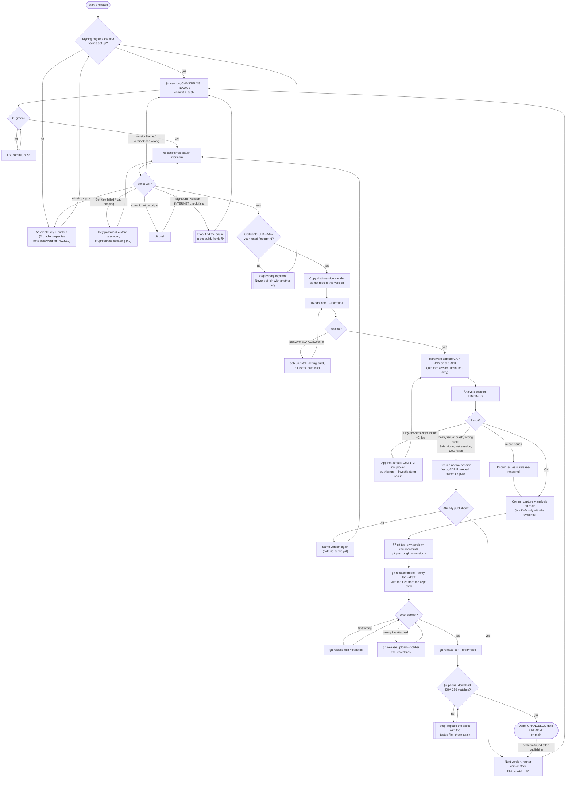

# RELEASING.md — How to publish a release of OpenControl for Pixel Buds Pro 2

The app is distributed manually, as a signed APK on this repository's GitHub Releases page — no app store, and no update check in the app (`DECISIONS.md`
ADR-004). This runbook was written in `ai-sessions/0065` (2026-10-02); every step is the maintainer's own act. An AI session may prepare files and print
commands, but it never runs a publishing step (tag push, release, upload, repository setting) without an explicit "yes" in chat for that step, and it never
sees the keystore or its passwords.

**Why the key matters** (developer.android.com, "Sign your app", fetched 2026-10-02): *"When the system is installing an update to an app, it compares the
certificate(s) in the new version with those in the existing version. The system allows the update if the certificates match."* and *"If you lose your
app's signing key, you lose the ability to update your app."* So: one key for the life of the app, backed up, never in this repository.

## Release checklist (copy it into the release's pull request and tick it there)

Added 2026-10-04 (`ai-sessions/0069`, the maintainer's request). `X.Y.Z` is the version; every step names the section with the details. Steps marked
**you** are the maintainer's own act; an AI session may prepare the others.

**A. Prepare — on a release branch, never on `main`**

- [ ] A1. Branch from an up-to-date `main`: `git switch main && git pull --ff-only && git switch -c release/X.Y.Z` (a maintenance session's own branch
      serves as well — one branch, several commits).
- [ ] A2. `android/app/build.gradle.kts`: `versionName = "X.Y.Z"`, `versionCode` = major × 10000 + minor × 100 + patch (§4).
- [ ] A3. `CHANGELOG.md`: the `[X.Y.Z] - not yet released` block (Fixed / Added / Known limits); `README.md`: status and known issues;
      `scripts/release_notes.template`: this version's summary line (§4).
- [ ] A4. Gate, locally: `cd android && ./gradlew assembleDebug testDebugUnitTest test lint`, and `python3 scripts/lint_docs.py` (exit 0).
- [ ] A5. Commit per concern (Conventional Commits), `git push -u origin release/X.Y.Z`, open the pull request: `gh pr create --base main --fill`.
- [ ] A6. Both CI workflows green on the pull request (Android build and test, docs lint). **Do not merge yet.**

**B. Build and verify — from the pushed branch tip**

- [ ] B1. **you** `scripts/release.sh X.Y.Z` on the branch tip (§5). It prints the **build commit** — write the short hash here: `_______`.
- [ ] B2. **you** The printed certificate SHA-256 equals the fingerprint in `README.md` / `SECURITY.md` (§1).
- [ ] B3. **you** Keep the build: `cp -a dist/X.Y.Z ~/opencontrol-X.Y.Z-tested`. Do not run the script for this version again unless a fix follows (C4).

**C. Test this exact APK**

- [ ] C1. **you** Install it in the test user (§6); the Info tab shows "App: X.Y.Z, build <the B1 hash>" without "-dirty".
- [ ] C2. **you** Run the planned hardware capture on film (the skeleton under `captures/`; a hotfix uses the reduced set of §11). Export the debug log,
      pull the HCI log, collect everything into the capture folder.
- [ ] C3. A new CAPTURE session analyses it: FINDINGS, notes, index and registry rows — committed on the **same branch**, after the build commit (these
      commits change no app file, so the tested APK stays the build of B1).
- [ ] C4. Verdict. **Heavy issue** (crash, wrong write, Safe Mode on the verified firmware, lost session): fix on the branch, push, back to A4 and B1 —
      the same version again, nothing is public yet. **Minor issue**: a "Known issue" line in `CHANGELOG.md` and in the kept `release-notes.md`.
      **OK**: tick the Definition of done only with this capture's evidence.

**D. Merge and publish — outward-facing, in this order**

- [ ] D1. **you** Merge the pull request with **"Create a merge commit"** (`gh pr merge --merge`). Not squash, not rebase: both would replace the build
      commit by a new one and the tag of D2 would point at a commit that is not on `main`.
- [ ] D2. **you** Tag the **build commit of B1** — not the merge commit, not `HEAD`: `git tag -s vX.Y.Z <B1 hash> -m "OpenControl for Pixel Buds Pro 2 X.Y.Z"`,
      `git push origin vX.Y.Z` (§7). Check: `git branch -r --contains vX.Y.Z` lists `origin/main`.
- [ ] D3. **you** Draft release with the three files **from the kept copy** (§7); read the draft on github.com; `gh release edit vX.Y.Z --draft=false`.
- [ ] D4. **you** On the phone: download the APK from the release page, compare its SHA-256 with the notes, install it over the tested one (§8).

**E. After publishing — a small pull request of its own**

- [ ] E1. `CHANGELOG.md`: the date in the `[X.Y.Z]` block, a new empty `[Unreleased]`. `README.md`: "Latest release", Status, known issues.
- [ ] E2. `RELEASING.md` §13: the Release log row (build commit, date, APK SHA-256, certificate SHA-256, capture).
- [ ] E3. The session log that prepared the release: its "Commits" section and Status (`AI_SESSION_LOG_PROCEDURE.md` §4b); `TODO.md` §1 emptied.
- [ ] E4. `scripts/release_notes.template`: remove this version's summary line, ready for the next one.

**What makes the record complete:** the pull request (description = this checklist and a link to the session RESULT), the per-concern commits kept by the
merge commit, the signed tag on the build commit, the Release log row, and the capture folder with its FINDINGS.

## Release flow — the normal path and what to do when something goes wrong

*(The diagram predates the branch workflow: where it says "commit + push" read "commit and push on the release branch, pull request open", and the
merge to `main` (D1) comes between the analysis and the tag.)*



**Rules behind the flow:**

- **Until a release is published,** nothing is public but a pushed tag: a fix may be rebuilt as the **same version** (the builds differ by commit hash and
  SHA-256; an equal versionCode installs over the tested one). Push the tag only after the analysis is OK, so this case stays rare.
- **After publishing,** never move or delete a pushed tag and never reuse a version: a fix is the next version with a higher versionCode (§4).
- **The published files are the tested files** — from the copy kept in §5, never a rebuild.
- **Releases are prepared on a branch and merged with a merge commit** (since 1.0.1): the build commit is the branch tip that `scripts/release.sh` built;
  the capture and its analysis are committed after it on the same branch; the tag goes on the build commit, which the merge commit keeps reachable from
  `main`. A build made from an uncommitted working copy shows "-dirty" on the Info tab — useful as a pre-check, never the file to publish.
- **The Definition of done** (`PROJECT.md`) is ticked only with the capture's evidence; a Play-services claim in the HCI log means "not proven", not "app broken".
  **Exception recorded for 1.0.0 (2026-10-03, the maintainer's decision in chat, `ai-sessions/0069`, "DoD ANC": *"Keep tick, reword + exception
  (Recommended)"*):** criterion 2's ANC change was ticked on the maintainer's own test of the 1.0.0 APK without Play services — `CAP-067` holds no ANC
  `Set` (0 × `08 12`). `PROJECT.md`'s Evidence table marks that row "maintainer-attested, not captured"; `CAP-068` (the 1.0.1 release build) is planned
  to replace it with frames. **From now on** each Evidence row names its type — *capture frame*, *film*, or *maintainer-attested* — and a
  maintainer-attested row is allowed only when it is written down as such, with the capture that will replace it.
  *Closed 2026-10-04 (`ai-sessions/0070`, maintainer-approved in chat, `AskUserQuestion` "DoD text"):* `CAP-068` holds the ANC change by the release build
  1.0.1 with frames (`CAP-068-FINDINGS.md` §2); the exception applied to 1.0.0 only.
- Every arrow that publishes (tag push, release create/edit/upload) is the maintainer's own act (see the top of this document).

(GitHub renders the diagram; the docs site shows its source text.)

## 1. Once: create the signing key

Run these yourself (keytool asks for the passwords and your name — the name ends up in the public certificate):

```bash
mkdir -p ~/keys && chmod 700 ~/keys
keytool -genkeypair -v -storetype PKCS12 \
  -keystore ~/keys/opencontrol-release.jks \
  -keyalg RSA -keysize 4096 -validity 10000 \
  -alias opencontrol
keytool -list -v -keystore ~/keys/opencontrol-release.jks -alias opencontrol | grep -i "SHA256:"
```

**One password, not two:** a PKCS12 keystore protects the store and the key with the **same** password — keytool asks only once and uses it for both
(it ignores a separate `-keypass` for PKCS12). Write the same value into both `OPENCONTROL_STORE_PASSWORD` and `OPENCONTROL_KEY_PASSWORD` (§2).

Write the `SHA256:` fingerprint down (e.g. in your password manager). Every release prints the certificate's SHA-256; it must be this value (keytool
prints it in upper case with colons, `apksigner` in lower case without — the same hex digits).

**Backup, right away:** copy `opencontrol-release.jks` to two offline media (e.g. two USB sticks kept apart), encrypted — for example
`gpg --symmetric --cipher-algo AES256 ~/keys/opencontrol-release.jks` and copy the `.gpg` file. Keep both passwords in a password manager. A lost key or
password means no update can ever be installed over the released app (users would have to uninstall, losing their settings).

## 2. Once: tell Gradle where the key is

In `~/.gradle/gradle.properties` (outside the repository; type the passwords in an editor, not on a command line), then `chmod 600 ~/.gradle/gradle.properties`:

```properties
OPENCONTROL_STORE_FILE=/home/<you>/keys/opencontrol-release.jks
OPENCONTROL_KEY_ALIAS=opencontrol
OPENCONTROL_STORE_PASSWORD=...
OPENCONTROL_KEY_PASSWORD=...
```

`OPENCONTROL_KEY_PASSWORD` is the **same** as `OPENCONTROL_STORE_PASSWORD` (PKCS12, §1). A different value fails at `packageRelease` with *"Failed to read
key opencontrol from store …: Get Key failed: Given final block not properly padded"* (seen 2026-10-02) — the store opened, the key did not. Mind the
`.properties` format too: a backslash is an escape character (write `\\` for one `\`), trailing spaces belong to the value, and non-ASCII characters may be
read differently; if a name appears twice, the last line wins. To check without showing a password, `keytool -list -v -keystore … -alias opencontrol` proves the
store password (it prompts).

Environment variables with the same names work too. Without all four, `assembleRelease` stops with *"Release signing is not configured: missing …"* — it never
builds an unsigned APK or one signed with the debug key (`android/app/build.gradle.kts`). Debug builds, tests and lint need none of this.

## 3. Once: signed tags (optional but approved, `ai-sessions/0065` I-3)

With an SSH key you already use for GitHub:

```bash
git config --global gpg.format ssh
git config --global user.signingkey ~/.ssh/id_ed25519.pub
```

and add the same public key on github.com → Settings → SSH and GPG keys as a **Signing key**, so GitHub shows the tag as "Verified".

## 4. Each release: prepare the commit

1. **Version** in `android/app/build.gradle.kts`: `versionName` = the version, `versionCode` = major × 10000 + minor × 100 + patch (1.0.0 → 10000,
   1.0.1 → 10001, 1.1.0 → 10100), minor and patch at most 99. The code must always grow — Android refuses a lower one over a higher one.
   **Release candidates exist only for `X.0.0`** (`1.0.0-rc.1` → 9901, N = 1…99): for any other version the candidate's code would not be above the
   previous release (`1.0.1-rc.1` would be 9902, below 1.0.0's 10000), so `scripts/release.sh` refuses it (changed 2026-10-03, `ai-sessions/0069`,
   `A68-HK-01`; the maintainer's choice "Script refuses unsafe candidates"). A hotfix or minor release is tested as the final version before its
   tag is pushed — nothing is public until then, and a fix may be rebuilt as the same version (see the rules above).
2. **`CHANGELOG.md`**: move the entries of `[Unreleased]` into the version's block (marked "not yet released"; the date is added on `main` after
   publishing, §8), with its **Known issues**. **`README.md`**: the status line and the "Known issues" block. **`scripts/release_notes.template`**: the
   feature and "Known issue" lines for this version.
3. Commit on the release branch, push it, open the pull request and wait for CI (`.github/workflows/android.yml`, the docs lint) to be green
   (checklist A5–A6). `scripts/release.sh` needs the commit on `origin` — a pushed branch is enough; `main` is not touched until the APK is tested.

## 5. Each release: build and verify

```bash
scripts/release.sh 1.0.0
```

It checks the version scheme and that the commit is on `origin`, builds in a separate clean worktree (so the Info tab shows the commit's hash without
"-dirty"), verifies the signature (`apksigner verify --print-certs`), the version and that there is no `INTERNET` permission, and writes `dist/1.0.0/`: the APK
(`opencontrol-pixelbudspro2-1.0.0.apk`), its `.sha256`, `THIRD_PARTY_NOTICES.txt` (the bundled libraries and their licences, `scripts/third_party_notices.py`)
and `release-notes.md` (from `scripts/release_notes.template`, checksums filled in). `dist/` is gitignored. It prints the next commands and runs none.

Check: the printed certificate SHA-256 equals your noted fingerprint; read `release-notes.md`. **Then keep this build:** copy it aside
(`cp -a dist/1.0.0 ~/opencontrol-1.0.0-tested`) and do **not** run `scripts/release.sh` for this version again — it empties `dist/<version>/`, and a new build
can have a different SHA-256: you would publish an APK you did not test.

## 6. Each release: test this exact APK

Install `dist/<version>/opencontrol-pixelbudspro2-<version>.apk` on the phone and run the planned hardware capture on it (for 1.0.0: `CAP-067`, in a
GrapheneOS secondary user without sandboxed Google Play — the route is in `ai-sessions/0066` RESULT §C.1; that run is also the evidence for `PROJECT.md`'s
Definition of done). On the Info tab: version and hash (no "-dirty"). A debug build installed before must be uninstalled first (different key).

With adb, into one user only (`adb shell pm list users` gives its id):

```bash
adb shell dumpsys package io.github.tedsluis.opencontrolpixelbuds | grep -E "versionName|User [0-9]+:.*installed=true"   # installed anywhere?
adb uninstall io.github.tedsluis.opencontrolpixelbuds    # only if a debug build is installed: removes it from ALL users, with its data
adb install --user <id> dist/1.0.0/opencontrol-pixelbudspro2-1.0.0.apk
```

`INSTALL_FAILED_UPDATE_INCOMPATIBLE` means another signing key's build is still installed in some user. Commits made on `main` while you test (documentation,
the capture and its analysis) do not touch the tested APK: the release is tied to the **build commit** (the hash on the Info tab), not to `main`.

## 7. Each release: publish (outward-facing — no way back once public)

The tag goes on the **build commit** printed by `scripts/release.sh` (the hash on the Info tab), even when `main` has moved on since — never on a later
commit, and never on `HEAD` by habit.

```bash
git tag -s v1.0.0 <commit> -m "OpenControl for Pixel Buds Pro 2 1.0.0"   # -a instead of -s without a signing key
git push origin v1.0.0
gh release create v1.0.0 --verify-tag --draft --title "OpenControl for Pixel Buds Pro 2 1.0.0" \
    --notes-file dist/1.0.0/release-notes.md \
    dist/1.0.0/opencontrol-pixelbudspro2-1.0.0.apk dist/1.0.0/opencontrol-pixelbudspro2-1.0.0.apk.sha256 dist/1.0.0/THIRD_PARTY_NOTICES.txt
```

Add `--prerelease` for a release candidate (`scripts/release.sh` does this for `-rc.N`). Open the draft on github.com, check the text and the three files,
then `gh release edit v1.0.0 --draft=false`.

## 8. After publishing

- On the phone: download the APK from the release page, `sha256sum` (or a checksum app) against the notes, install over the tested one — an update keeps
  the settings.
- `CHANGELOG.md`: the date in the block; a new empty `[Unreleased]`.
- `README.md`: the "Latest release" line and the Status paragraph.
- **Release log** (below): one row — version, build commit, date, both SHA-256 values, the capture.
- The session log of the session that prepared the release: its "Commits" section, completed (`AI_SESSION_LOG_PROCEDURE.md`, closing checklist).

## 9. Repository settings (done)

Both settings of `ai-sessions/0065` I-10/I-11 are in place (checked 2026-10-03: `gh api repos/tedsluis/opencontrolpixelbudspro2/private-vulnerability-reporting`
→ `{"enabled":true}`; `gh repo view --json repositoryTopics` lists `grapheneos` and `android-app`, no misspelt topic). Nothing to do for a release.

## 10. README media

A new screen recording becomes GitHub-ready media with `scripts/readme_media.sh <recording.mp4> images/<name>` (ffmpeg only): an H.264 MP4 without
audio or metadata, checked against GitHub's 10 MB video limit, a short GIF preview and a poster PNG. Look at every frame before committing — the script
does not blur anything.

## 11. Hotfix release (1.0.x)

A hotfix is a normal release with a smaller test set (added 2026-10-03, `ai-sessions/0069`; the maintainer's choice "Hotfix 1.0.1": *"1.0.1 with all of
0069 (Recommended)"*).

1. Fix on `main` in a normal session: a failing test first, the fix, the gate (`./gradlew assembleDebug testDebugUnitTest test lint`), CI green.
2. §4 with the next patch number (1.0.1 → versionCode 10001). No release candidate (§4).
3. §5, then §6 with the **reduced hardware set**: connect, battery, one ANC change from the tab and one from the tile, the changed behaviour itself, a
   Bluetooth off/on, Disconnect/Connect, and an export of the debug log — in the user without Google Play, on film, as a registered capture. For 1.0.1
   that capture is `CAP-068`.
4. A hotfix that changes a **write** to the Buds (new bytes on the wire) is not a hotfix: it needs its `PROTOCOL.md` entry, its ADR and a full capture.
5. §7 and §8 as usual. The published 1.0.0 stays available; the release notes of the hotfix say what it fixes.

## 12. New Buds firmware

The app changes settings only on the firmware it was verified with (`release_5.203`, a constant — `DECISIONS.md` ADR-042 item 4). When Google updates the
Buds, every installed copy opens in read-only Safe Mode until a new app release. That is deliberate; there is no user override (the maintainer's decision
in chat 2026-10-03, `ai-sessions/0069`, "Safe Mode": *"Runbook + README, no override (Recommended)"*). What to do (`A68-DEC-03`):

1. **Record the new version.** Connect with OpenControl: the Connection tab shows the firmware string and the Safe Mode card. Export the debug log.
2. **Capture the connect burst with the official app** on the new firmware (Pixel 7a, HCI snoop, film) — a registered capture, as `CAP-036`/`CAP-041`.
3. **Compare with `release_5.203`:** `python3 scripts/pwrpc_decode.py <log>` — the announcement (`GetSoftwareInfo`, channel 19 or 21), the
   `ReadSetting` sweep (every field's status and value shape), `SubscribeRuntimeInfo` (entries 6.1–6.3, 7); on the Message Stream the model ID,
   the ANC `Get`/Notify and the battery update. Write every difference into the capture's FINDINGS.
4. **Replay the write fixtures on film, with the official app first:** one ANC change, one EQ change, one of each setting the app writes
   (ADR-045/046/047), Ring Left/Right — and check that the bytes equal the fixtures in `android/data/src/test`.
5. **Only if nothing differs:** add the firmware string to the allowlist (one constant), add the new capture's fixtures to the tests, and release (§4–§8,
   or §11). **If something differs:** it is a protocol change — `PROTOCOL.md`, an ADR and the maintainer's approval first.
6. Until the release is out: `README.md` ("Safety and Safe Mode") tells users what Safe Mode means; pin an issue naming the firmware version.

## 13. Release log

| Version | Build commit (tag) | Published | APK SHA-256 | Certificate SHA-256 | Hardware capture | Notes |
|---|---|---|---|---|---|---|
| 1.0.0 | `8d8af4b` (`v1.0.0`) | 2026-10-03 | `107d49b609a3509364f92e2911931e9ff51ae1dd62f96405026c27464f3467a2` | `a7530f5ceadcdfc9cddcbb0e9889e7699961e8a4ef18898c4ec7738cc79d8dcb` | `CAP-067` | Published by the maintainer. Definition of done 2 (ANC) maintainer-attested (see the rules above). Known issue in the notes: the connect-failure text. Commits around the release that no session log names: `adc8c1f` (this runbook: one PKCS12 password, the flowchart), `9e2a475` (the doc tools skip `dist/`), `d25edb8` (1.0.0 marked as released) |
| 1.0.1 | `e1fc886` (`v1.0.1`) | 2026-10-04 | `f9dce033d3a42d93892b90ebe7b77347385c93602bdec099f59d232963b15e0f` | `a7530f5ceadcdfc9cddcbb0e9889e7699961e8a4ef18898c4ec7738cc79d8dcb` | `CAP-068` | Hotfix (`ai-sessions/0069`); release approved in chat 2026-10-04 (`ai-sessions/0070`). Definition of done 2 with frames. Known issue in the notes: the ring notice after a stop on the bud. Tag and GitHub release: the maintainer's steps D2/D3. |

The certificate SHA-256 is the same for every release (§1); it is also in `README.md` and `SECURITY.md`.

## Not used (decided `ai-sessions/0065`)

- **Signing in CI:** the key would leave this machine as a repository secret; releases are built and signed locally (checkpoint answer (d) "None now").
- **R8/minify:** the release is the same unminified code the tests and hardware runs checked (`ai-sessions/0066` RESULT §C.5).
- **Key rotation** (`apksigner rotate`, APK Signature Scheme v3) exists for a compromised or weak key; not needed while the key is safe.

---
https://github.com/tedsluis/opencontrolpixelbudspro2/blob/main/RELEASING.md - https://tedsluis.github.io/opencontrolpixelbudspro2/RELEASING
