# Pixel Buds app (Englisch)

Original screenshot pixel buds pro 2 app (`https://play.google.com/store/apps/details?id=com.google.android.apps.wearables.maestro.companion`)

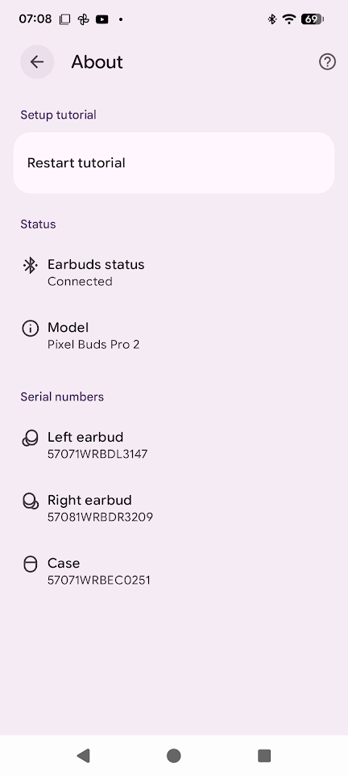
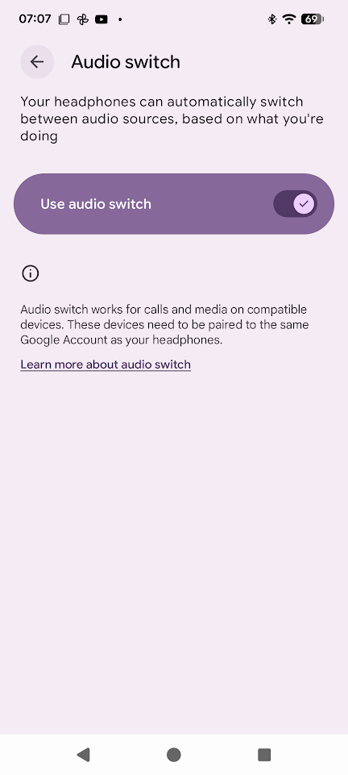
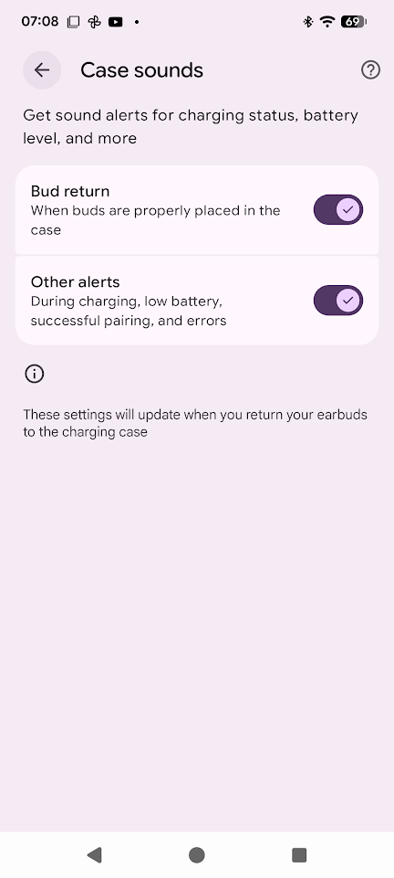
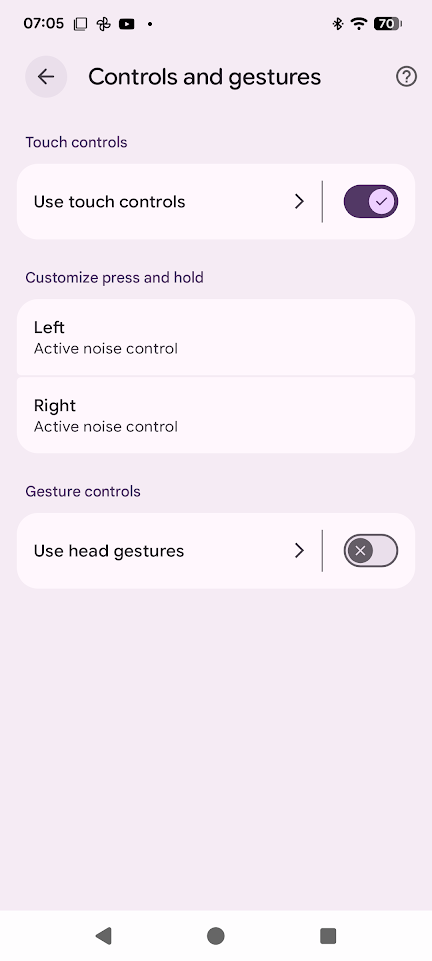
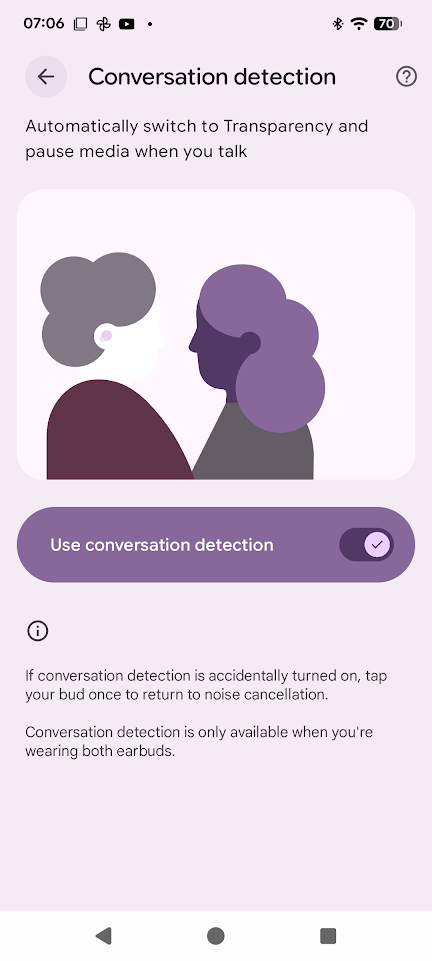
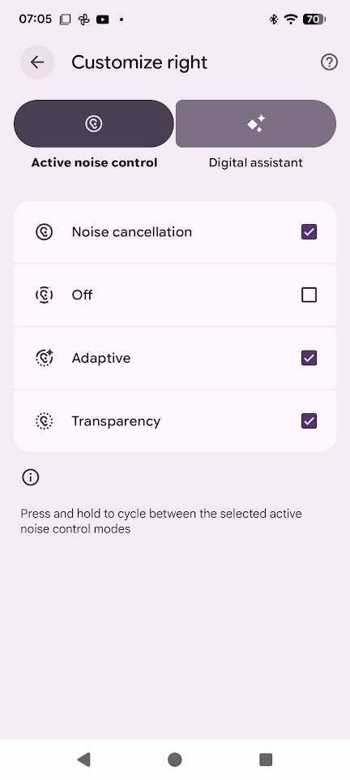
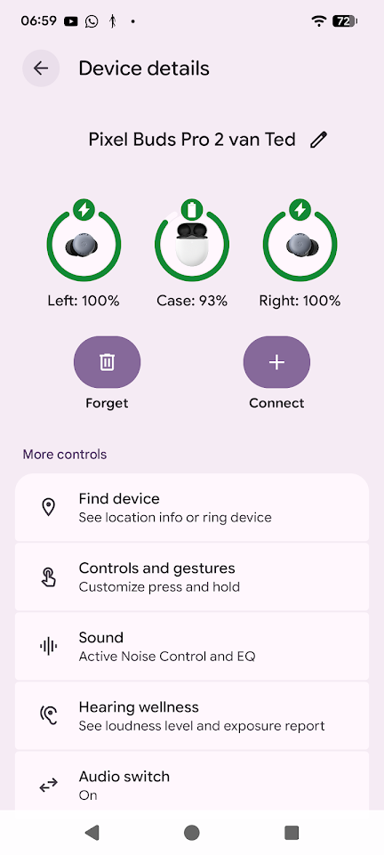
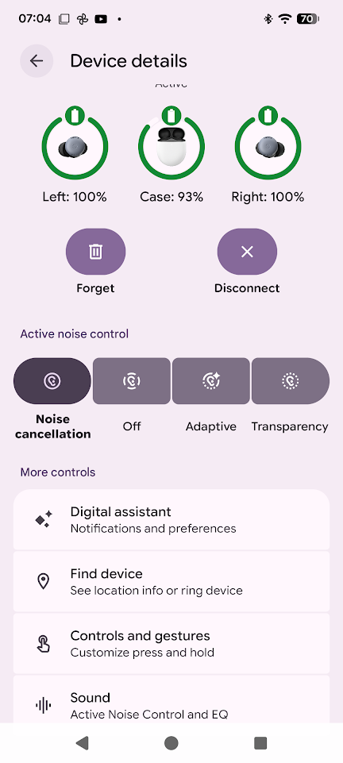
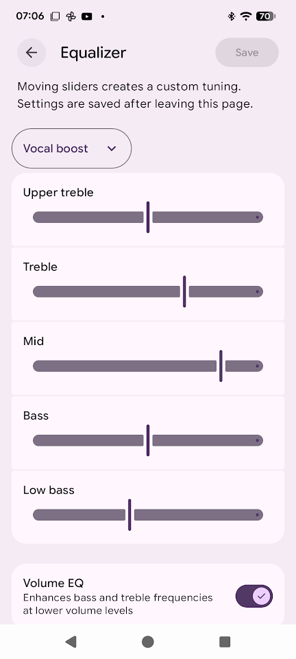
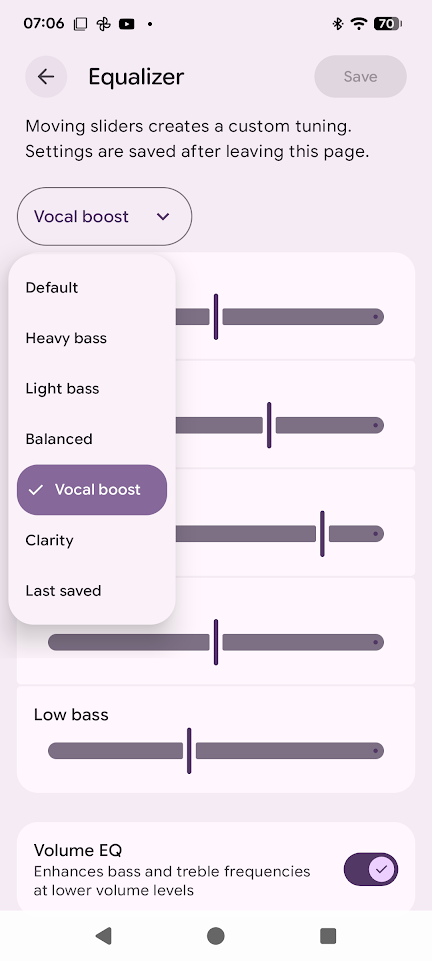
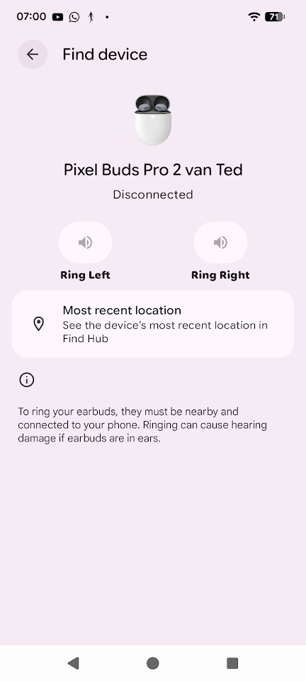
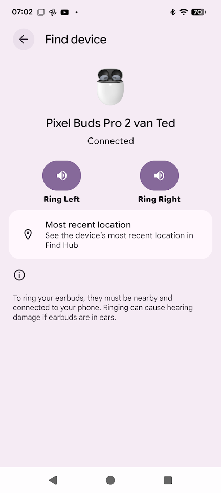

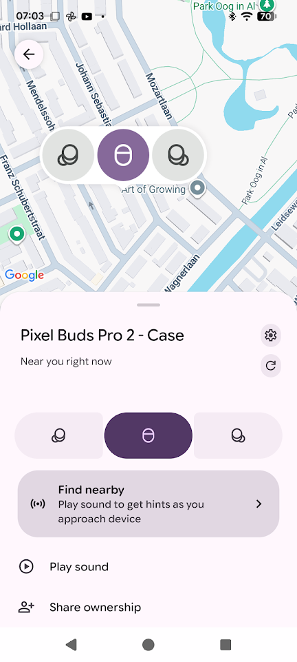
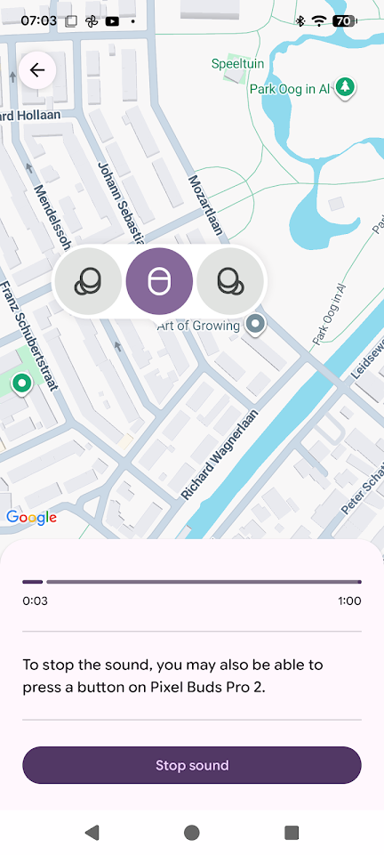
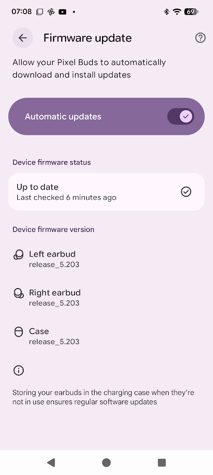
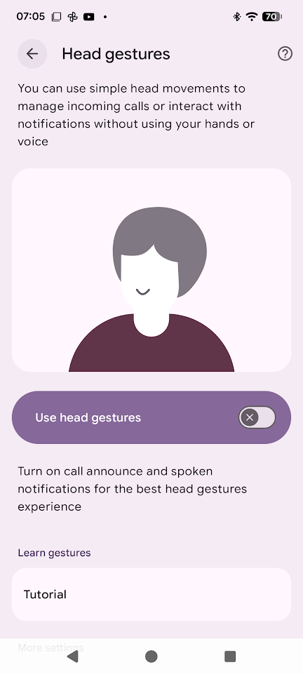
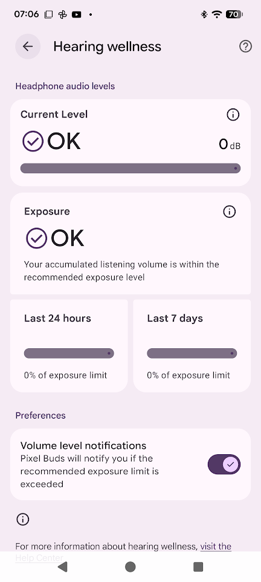
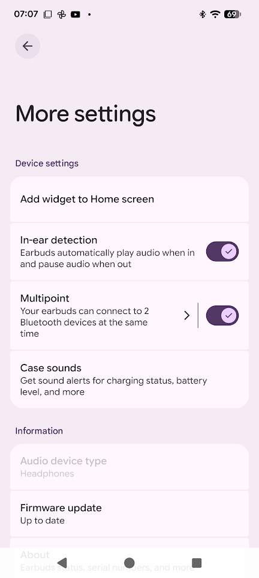
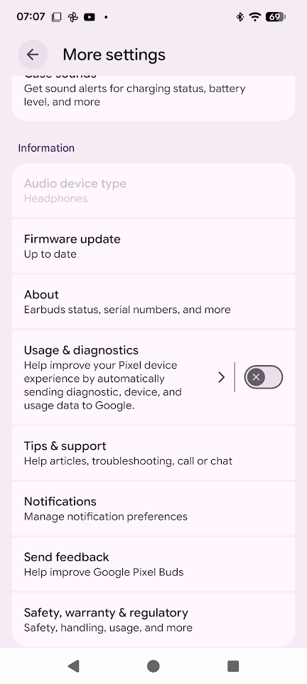
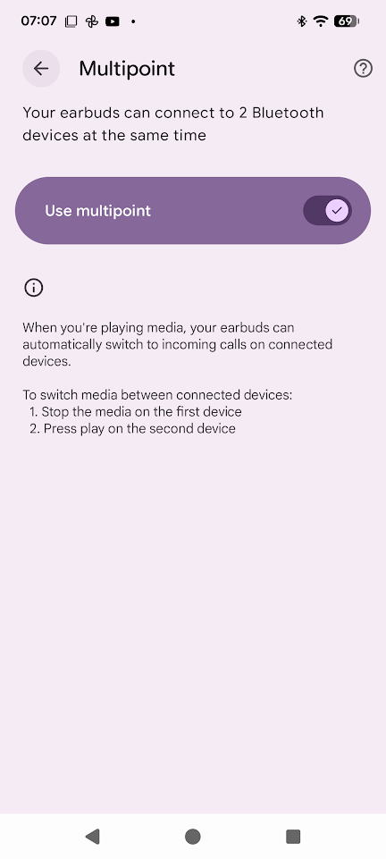
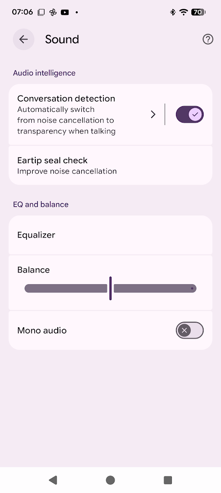
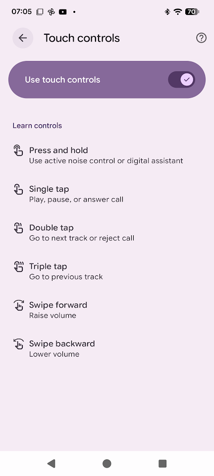

---
https://github.com/tedsluis/opencontrolpixelbudspro2/blob/main/SCREENSHOTS_PIXEL_BUDS_APP.md - https://tedsluis.github.io/opencontrolpixelbudspro2/#/SCREENSHOTS_PIXEL_BUDS_APP
